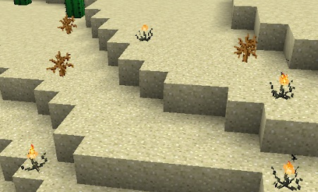
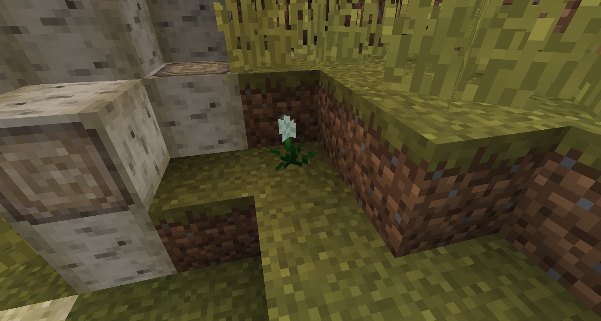

Cinderpearl is a flower that gives off a small glow. It can be found in deserst biomes and can be converted into blaze powder. Shimmerleaf can be found growing below silverwood trees, which can be converted into quicksilver.

