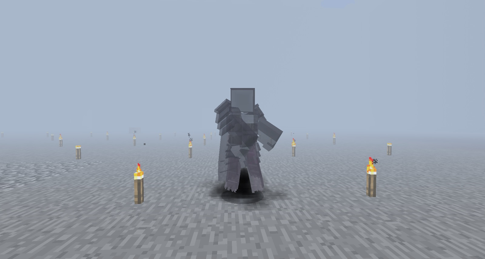

While working your way through Thaumcraft you will notice that some research has a purple swirl around it. You will also notice that you will be warned that completing a particular research will give you a little bit of warp. 

Warp affects your mind. A little warp is fine and inevitable but over time you may get more and more warp. This can cause strange visions and can also kill you:

The more warp you get the more insane you go. There is a way to look at how insane you are but you will have to go a little insane before you find out what you can craft to measure your sanity.

### Warp Effects

With warp come some side effects:

**Sun Scorned IV** - Every thing is very bright

