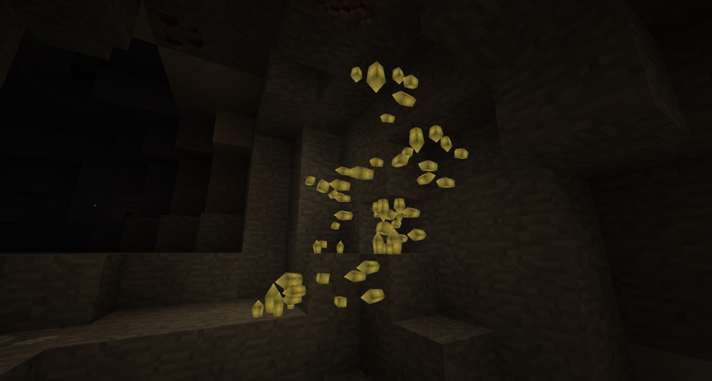
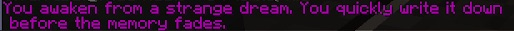

Unlike previous iterations of Thaumcraft, you will not spawn with a Thaumonomicon. Instead, you will first have to collect some vis crystals. There is no doubt you have come across these already around the world:

There are a total of 6 different crystals throughout the world but once you mine your first one (colour does not matter) a message will appear on your screen:

Head home and sleep. It is recommended you grab more crystals (in a variety of colours), cinnabar ore and amber bearing stone before heading home. 

As soon as you wake up you will see another message as well as receive a book of “Strange Dreams.” Reading the book will give you more details on what you should do next:

