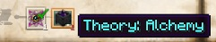

Place down your table and then right-click it with one of the scribing tools in hand (this will use up the scribing tools but will put them in the top left of the table). Your scribing tools will not last forever and will run out of ink. Although, they can be repaired/refilled by combining them with an ink sac. Right-click the table again to open it. This table has a slot on the top right corner for paper that you should keep full when possible:

You will also notice a bookshelf in the middle. This is because the research table is next to a bookcase. The table will detect helpful blocks that are up to 4 blocks away. There are also 5 light bulbs - these are called “inspiration”. As you progress through the mod you will gain more and more ideas. There are also other items that will give you extra research options such as:

* Bookshelf - Gives more “Fundamentals” options
* Crucible - Gives more “Alchemy” options
* Runic Matrix - Gives more “Infusion” options
* Golem Press - Gives more “Golemancy” options
* Brain in a Jar - gives more “Eldritch” options
* Beacon - Gives more “Auromancy” options
* Focal Manipulator - Gives more “Auromancy” options
* Enchanting Table - Gives options which use levels for research

Each time you use one of these bonus items (click it and then press “create theory”) it will use up one of your Inspiration but will help to focus your research on a given field. 

The first set of research will be done without the bookshelf. Clicking on ‘Create a Theory’ will bring up papers on the left and a question mark. Clicking on the page will give you options:

Clicking the page will start your progress through a few fields. You will end up completing theories using up your Inspiration (the light bulbs). Any theories you do complete will contribute to your progress: 

Research has many different Fields (Categories) to gain experience levels in (as does Observation Scanning). These are completely separate from vanilla Minecraft XP but you can gain XP by completing tasks or earning research or observation experience. 

The highest field or fields, depending on the different papers you come up with, will be at 100% experience gained. The lower ones will be on a 33% reduction (hence the -0 next to the Fundamentals).
 
Clicking on the next page with a question mark will bring up 2 pages and will give you an option. 

>>>>**Your research may differ!**

With some of these pages there is a cost (this cost being ideas/lightbulbs). Others may not have any cost, but they can still affect your experience progress. You might also notice that your highest field may change.

‘Rethink’ pages will give you extra inspiration. This is almost always beneficial unless you are finding yourself unable to complete some research tasks. Some tasks require you to have certain items in your inventory, some require having that item and completing that task will consume the item (Shown with an exclamation mark). Some tasks consume EXP, and others still consume current research. Always read carefully before choosing a selection.

Once you have run out of inspiration (light bulbs) you can complete your theory:

You can cancel the theory at any time, even at the last stage you can just mine up the table (all XP in each Category will be lost).

There will be some pages that have an item on the page with an orange exclamation mark next to it. This means that there is a requirement for that item and it will consumed with that theory completion. If there is just an image of an item then you will just need to have it in your inventory and it will not be consumed.

You can now navigate to the Theorycrafting section of your Thaumonomicon and complete the stage. You will need to craft the items that are required as cheating them in will not complete them..

The next few pages will give you more details about the Research table.

When using the Bookcase for Research, you will notice that a lightbulb will be removed and that some pages have **RUNES** around them, this is one of the bonuses you get from using the bookcase (and other items).

This page will give you extra bonuses. You can **SCAN** your table. You can also use the Celestial Notes you have gotten from scanning the Sky at night and during the day. These can be used in the research table (when the pages come up) to get **BIG** bonuses. **BUT** you will need to have the correct Notes.

When working on any Stage in the Thaumonomicon you will either have to do 1 type of research or both to get the required points:

Just ensure you check what research you need to do by hovering over them. This way you don’t waste time doing research when you should be scanning things instead.

