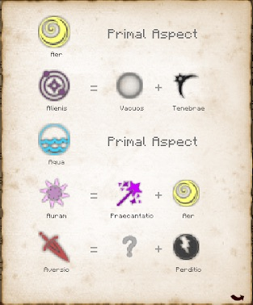

Above the Fields tab you will be able to see the Aspects of Essentia you have discovered via scanning and their combinations. Scanning more will help you find new types and the combinations for them: 

[Aspect Sources (/r/thaumcraft)
](https://www.reddit.com/r/Thaumcraft/comments/8gtfak/sources_of_essentia_mega_guide_tc6/)

