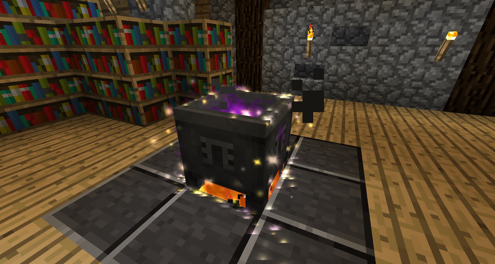

After doing some scanning and research you should have unlocked the Observation: Alchemy field. Once you have done this, go to your Thaumonomicon and complete the first step of the Discovering Alchemy stage.

The next step will require you to make a Crucible. This is done by right-clicking Salis Mundus on a Cauldron:

If your Crucible is close enough to your research table you will get another icon on the table giving you more bonus research:

The Crucible will allow you to insert items, break them down to their aspects and will allow you to combine them to make new items. This is a very crude way to making items because any extra aspects will be released into the air causing FLUX. The more flux you have in the air, the higher chance you have of causing Taint, and Taint is not good.

In order for the Crucible to work it will need to be filled with water and have a heat source below it. You can use fire, lava, magma, or later nitor.  To insert items into the crucible you can either drop them in or right-click them onto the Crucible while in hand. Later, using Goggles of Revealing will give you the ability to tell which aspects are currently in the crucible. Be careful not to right click the water with an item as you _will_ lose it.

>>>>PLEASE ENSURE THE CRUCIBLE IS IN A SAFE AREA. ACCIDENTS DO HAPPEN AND ITEMS WILL BE LOST IN THE CRUCIBLE.
