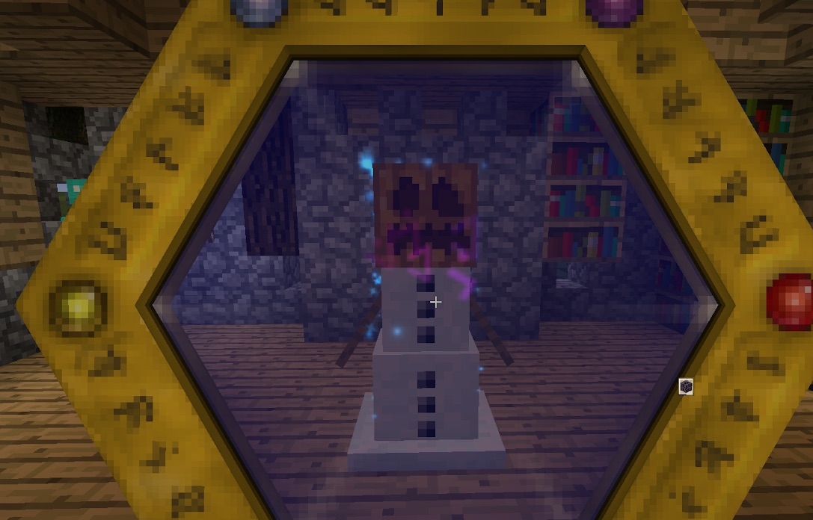

This is the last basic section in the Thaumonomicon. In order to complete this quest, you will need to do some research to discover Observation: Golemancy, and you will also need to scan an iron or snow Golem in order to study an animated construct.

Once you have scanned a golem, you should be able to complete this section. Once completed, you will have access to a new tab: Golemancy:

This tab is covered later on in the guide.
