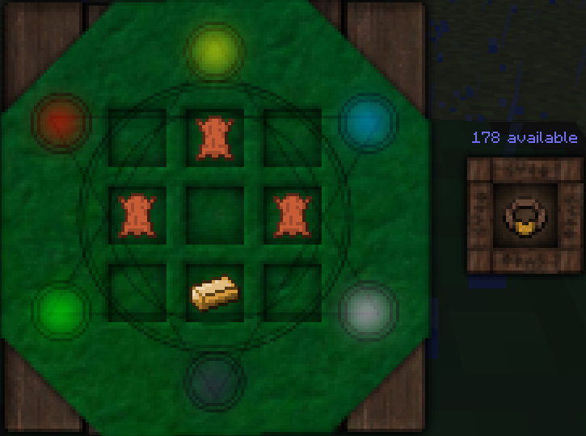
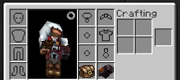
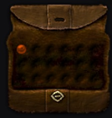

You should have done enough scanning and research by now to unlock the Focus Pouch and complete this quest.

The Pouch is very simple to craft and is very handy for storing Foci, but can be left for later if you find yourself only using one or two as it has a high leather cost.

You can put this into your belt slot under your baubles equipment (open your inventory, press the circle next to your character). The Pouch will automatically put your Foci into it when you unequip them (sneak + F), and will let you select any you have. This means you don't have to clog up your inventory with foci:

