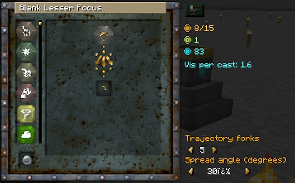

Now you can lay mines and shoot lightning (amongst other things). The scatter modifier will split trajectories into multiple, random trajectories. Meaning you can shoot lighting and have it split off a few times.

In the Focal Manipulator you can set the scatter in the top of the list (scroll down on the left, it's right at the bottom). You can then set the number of forks and the area it will affect in a cone shape in front of you. For best results, set it to 10-30%.

Then you can add your desired medium, such as mine or projectile, and your desired element (such as earth). With mine, you can pump up the angle to 360 and the number of projectiles to 10. 

This makes the mines very powerful and drops 10 at a time, instantly killing most mobs. These will disappear over time.