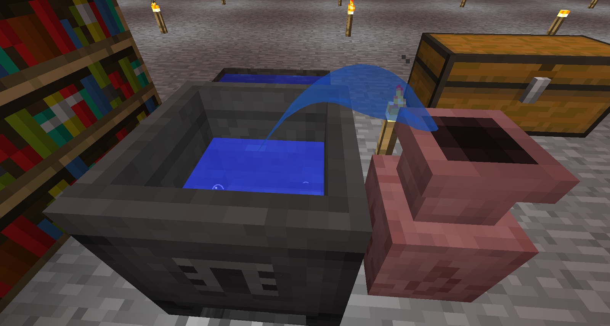

You might need to do a bit of research to complete this section. Once you have completed it you will be able to craft the Everfull Urn:

The Easiest way to craft this in your crucible is to craft two, but this will give you 1 flux. You can use the following to craft 2 urns:

* 6 Water Bottles
* 20 Cobblestone Slabs
* 1 Crafting Bench

Adding these to the Crucible, then two flower pots will give you 2 Urns and 9 Herba left in the Crucible. Sliver as much out as you can and then release the remaining one as flux.

The Everfull Urn is a great tool when doing lots of Alchemy as it will fill up your crucible. You can have it up to two blocks away from your crucible, on the same level. This should keep your Crucible topped up without needing to manually fill it.

