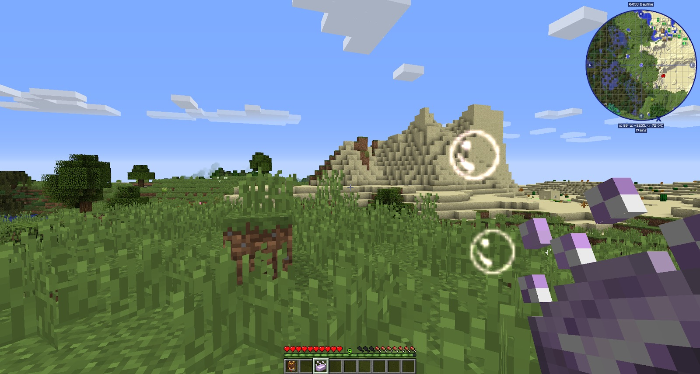
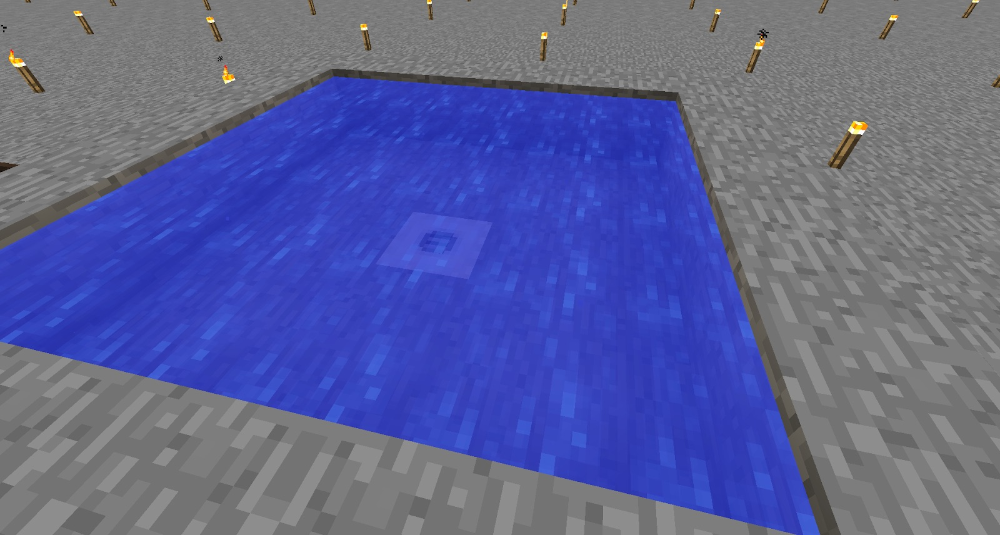

Some stages will give you Warp when you complete them. Warp is not good, and can have some very strange side effects. By making bath salts, you can work your way to Sanity Soap.

Sanity Soap will wash away temporary warp. It’s best to use this once you start completing more stages that can give you a warp.

Using Soap is a chore and requires you to carry around more items. If you complete the Arcane Spa stage, you will be able to craft the Spa. Pump water into it and fill it with Bath Salts. This will then fill a 5x5 area with water. This way, you can hop in and hop out without having to wash yourself with soap:

