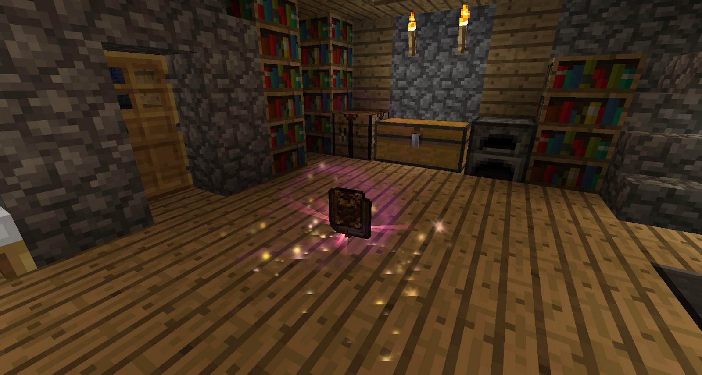

With the salis mundus in hand, right-click a book shelf and watch it turn into your Thaumonomicon:

Like many other mods Thaumcraft uses this book as your guide and reference manual. When opening up the book you will see a tree. This tree will expand as you progress through the mod and as you read more of the book. 

Note: In order to reach certain levels you will need to flick through the pages. Please make sure you read through any new pages or certain things will not unlock. This book is also like a quest book where you will need to “complete” quests in order to progress

Please be warned that "item magnet" type items, if fast enough, can prevent the detection that you actually have the thaumonomicon, this can be fixed by disabling the magnet and throwing the thaumonomicon onto the ground then picking it up directly instead of with the magnet:

The First Steps segment of the book explains a little more about salis mundus and will give you a crafting recipe. It will also advise you on what you should be making next. After reading the “First Steps” stage you will also unlock new stages which will pop up on the top right of your screen:

When viewing the “opening page” of the book you will notice that certain steps have “stages”. This means there are multiple steps to completing the “stage”.

