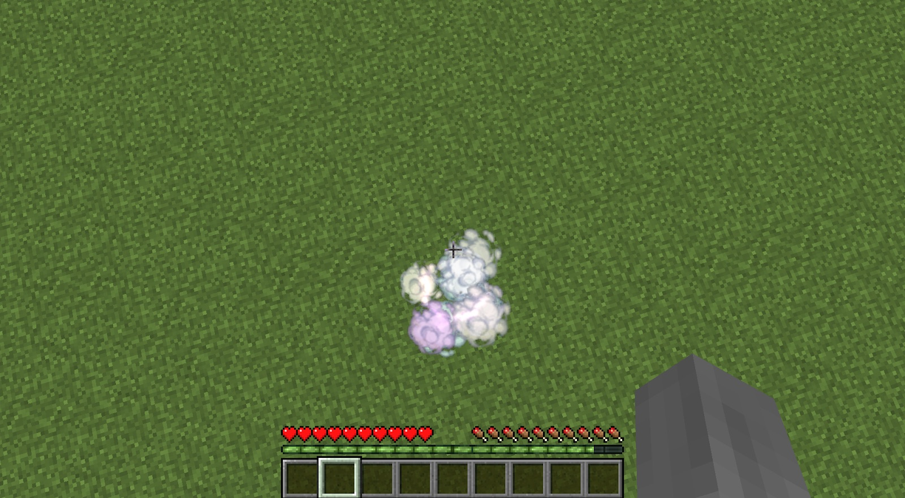

The Cloud Stepper ring will allow you to “double jump.” It is simple to make; just add a Mundane Ring (made with Alchemical Brass Nuggets) to the middle of your Infusion Altar and then add an Aer Vis crystal and a feather to two of the Pedestals around the altar. Remember: symmetry is key. You will also need to have a small supply (50) of Aer Essentia nearby.

Right-clicking the Matrix with your Gauntlet will start the process and will give you a Cloud Stepper ring. You equip this in your Baubles ring slot. Jumping twice in quick concession will spawn a cloud below your feet letting you jump a second time. It also reduces fall damage somewhat.

