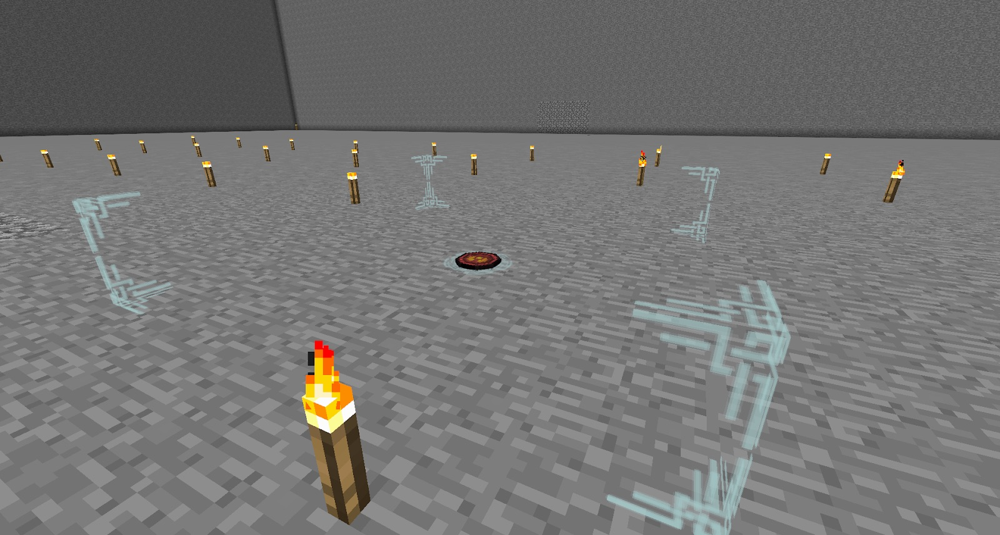

Having your Golems walking round and doing nothing is not very useful. The only way you can get these guys to work or do anything is with Seals. 

Seals are placed into the world and then configured with the Golemancer’s Bell. Some Seals have more configuration options than others, and some are as simple as putting them down and telling which Golem to do what.

When putting a Seal down in the world, you will notice that it almost becomes invisible. This is normal and not a bug. You can view the Seal again by having your Golemancer’s Bell in hand. You can put other blocks on top of your Seal, and you can put down more than one Seal on one block. You can pick Seals back up again if you sneak-right-click on them with the Bell.

The Golemancer’s Bell will show you where the Seal is and the area in which the seal is active. It is also used to configure the Seal:

When right-clicking a Seal with the Bell, you are given a list of options on the left. This might not be the same for all Seals, but the collection seal has some great examples:

From top to Bottom:
* Area
	* Choose how big of an area you want the Seal to be active.
* Filter
	* Blacklist or Whitelist items.
* Priority/Locking
	* Lock the Seal so only your Golems can use this Seal, or set the priority higher or lower. Also set the colour of Seal.
* Requirements
	* Some Seals will need Golems to have, or specifically, to not have certain traits.
* Redstone
	* Turn this Seal on and off with redstone, or ignore redstone.

You can set colours to Seals, meaning you can also set Golems a colour, so only they will interact with the same coloured Seal. You can right-click Golems with Dyes and pick them up again to remove the colour:

Seal crafting is very simple. There are a total of 15 different seals: 11 are simple and 4 are advanced versions of the simple ones.

